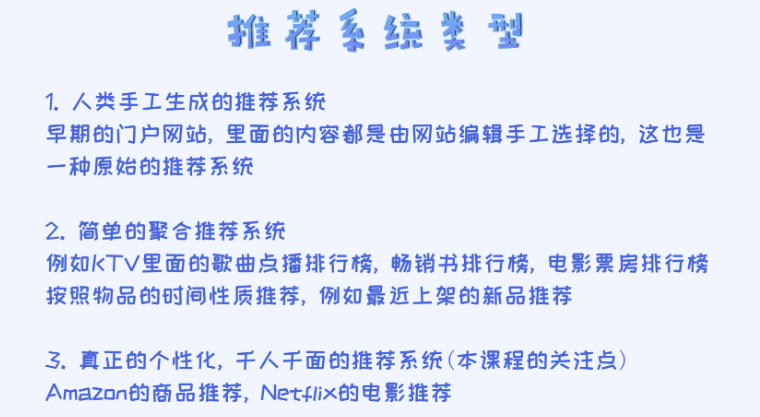
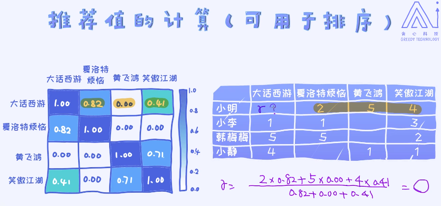

## 19 基于内容的推荐：买什么就推荐跟它类似的
### 19.1 推荐系统概论

#### 推荐系统类型

在本章，我们重点来关注两类算法，分别是**基于内容的推荐**和**基于协同过滤的推荐**

第一种算法的思想也特别简单：我之前喜欢什么，就推荐给我什么，非常直接。很多电商领域的板块其实是用了基于内容的推荐，比如亚马逊的推荐栏目。

### 19.2 理解基于内容的推荐
基于内容的推荐系统。简单来讲：推荐跟之前购买的类似的商品。
基于内容推荐的方法特别适用于文本领域，比如新闻的推荐等等。

基于内容的推荐系统，其核心是**首先构造商品画像**，之后根据此画像来寻找最相似的其他商品。 
通过**计算相似度**来判断哪些是最相似的商品。 
那又如何计算相似度呢？ 每一个商品转换成了向量的形式，所以相似度的计算无非就是要度量两个向量之间的相似度。最经典的评估方法就是使用**余弦相似度**。 
所以在这个方法论下，物品向量尤其重要。如何准确地刻画物品向量决定着整个系统的性能。

### 19.3 商品向量的构建
其实可以理解成特种工程。

文本可以直接使用**tf-idf**的方式即可以转换成向量的形式。当然我们也可以使用**word2vec**等技术来表示成向量的。

以电影为例：一个电影会有各种各样类型的特征（比如：类别字段特征、描述字段特征、导演字段特征），所以最终需要把这些所有的特征做一个拼接，就可以得到很长的特征向量，也可以叫做 画像。

### 19.4 商品相似度计算

- 1.计算出物品的相似度矩阵

$$
similarity = cos(\theta) = \frac{\vec A\cdot \vec B}{||A|| \cdot ||B||}
$$

​         计算两两之间的余弦相似度，然后得到相似度矩阵。

- 2.结合历史记录，预测对某件物品的喜好程度

加权平均

#### 基于内容推荐的优点

- 为某一用户做推荐的时候不需要使用其它用户的数据
- 可以为具有特殊口味的用户做预测
- 可解释性好，产品的特征决定了推荐值

#### 基于内容推荐的缺点
- 某些物品的特征提取比较难
  
  + 例如：图像，音乐，电影，如果没有提供者提供元数据，自动提取特征比较不容易
  
- 过于专门化
  + 永远不会推荐和用户曾经喜欢的物品不相干的物品
  + 完全没有利用其他用户的喜好来提高对此用户的推荐质量
  
- 对于新用户有**冷启动问题**
  
  + 刚出现的用户其用户画像为空，无法做出推荐
  
- 最后，基于内容的推荐还有一个大的问题，就是**如何去维护物品之间的相似度**。这是一个**庞大的矩阵**，设想一下总共有N个商品。那这个矩阵的大小为N乘N，数量级很大。  

  解决方案：因为物品数量庞大，所以矩阵是一个稀疏矩阵。很多物品之间相似度是趋于零的，我们可以把这些相似度趋近于零的抛弃掉。相似的物品占比较低。例如可以把跟一个物品相似度较高的其它商品存放在缓存里

冷启动的解决方式：
- 让用户标注自己的兴趣。这种情况其实在很多APP刚安装的时候经常可以见到， 其实就是为了解决冷启动问题。
- 推荐最流行的产品或者最近最火爆的产品。这其实就是聚合的推荐， 比如推荐目前热度最高的商品。

#### 总结
- 适合文本类的推荐系统（如新闻）
- 核心在于把商品描述和内容更好的结合起来
- 根据场景，需要做调整

