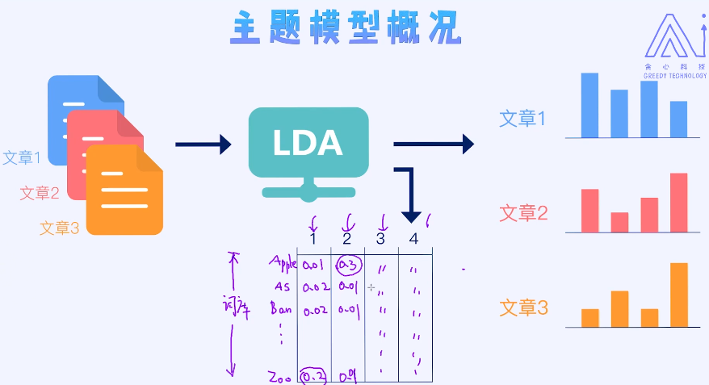

## 21 搭建门户网站的新闻推荐系统

### 21.1 推荐系统框架介绍

#### 如何设计一个简易的推荐系统？

例：使用**主题模型**(**LDA**模型)从每一篇新闻中抽取主题的分布，然后基于新闻里的==主题向量==再做推荐(需要计算**相似度**)。

- 简单来讲，比如一个用户之前经常看体育类的新闻，那我们之后就给他推送跟体育相关的。
- 但这里需要注意的一点是，每一篇新闻可能包含多个主题。例如，一篇文章80%的篇幅讲的是体育主题，剩下20%的内容讲的是跟娱乐相关的。那这时候，我们可以把这个新闻表示成一个主题向量 - **（0.8, 0.2）**。这里的每一个数值代表某个主题的分布，或者你可以简单理解成是权重。
- 抽取完主题向量之后，我们即可以评估出用户的喜好程度，之后再推荐相应的新闻。

---

简而言之：1. 提取用户最近阅读历史生成一个用户向量$h$，2. 提取新闻文本生成主题向量$b_1,b_2,\cdots,b_n$, 3. 然后计算内积，再进行排序。

向量之间的相似度计算方法：余弦相似度，欧式距离，曼哈顿距离......

### 21.2 文本的清洗技术

#### 文本预处理

- 分词，英文一般用空格，中文需要根据算法，比如**结巴分词**
- 噪音处理，比如：无用符号、停用词、出现次数少的单词

在处理过程中还是要注意参数的选择。比如对于出现次数少于10次的单词我们可以忽略掉。那这里的10次到底如何确定呢？ 可以通过可视化的方式来先看一下具体词频的分布，之后再合适的地方上做一个切分。这个过程也需要做一些验证，比如多尝试几个阈值看看哪一个阈值效果最好。

另外，在英文里面我们经常会做一些词的**标准化操作（normalization）**。这里有两种常用的算法分别是**Stemming(前面提过)和Lemmazation**。

#### 下面主要讲Lemmazation

Lemmazation是文本预处理中一种比较经典的技术。

==Stemming==是把很多类似的单词改造成一个统一化的单词(*go,doing,went--->go; deny,denied--->==deni==*)  规则

==Lemmazation==(*go,doing,went--->go; deny,denied--->==deny==*)   规则+先验  

**WordNet**

### 21.3 利用主题模型提取主题特征

本节知识要点**主题模型**，即从文章中提取主题的分布。

主题模型，英文也叫作**LDA（Latent Dirichlet Allocation）**。在机器学习发展史上，主题模型也算是一个里程碑式的成果，掀起了大家对**概率图模型**的热潮。

主题模型可以归类为**贝叶斯模型**

LDA的两个输出结果，**文档的主题分布**和**主题单词的分布**。

开源的工具很多，在这个项目中将需要使用**gensim**工具。

#### 小结

- 主题模型属于**贝叶斯模型(Fully  Bayesian)[^1]**​
- 主题模型是**生成模型，以无监督的方式来学习**
- 主题模型属于**Mixed MomBership模型**
- 对于主题模型的推导需要**近似算法**如MCMC

----

注意区别MLE，MAP, Bayesian区别

[^1]: 贝叶斯模型区别于最大似然估计和最大后验估计，其实是一种集成式的模型 

